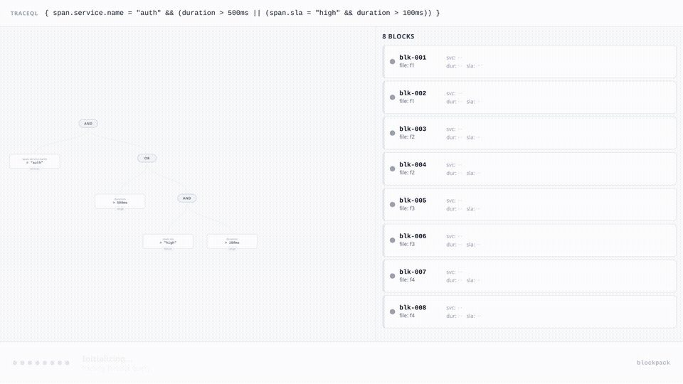

# Execution Path

When a TraceQL query arrives, blockpack runs it through a multi-stage pipeline that progressively narrows the set of blocks to read before evaluating any predicates against individual spans.

## Animation

The animation below traces a real query through the block pruning and span evaluation stages — watch how the predicate tree activates and blocks are eliminated at each step. Query parsing and VM compilation happen before the animation begins.

**Query:** `{ span.service.name = "auth" && (duration > 500ms || (span.sla = "high" && duration > 100ms)) }`

## Pipeline Stages

### 1. Query Parse

The TraceQL string is tokenized and built into a typed AST. The parser identifies the query type (filter, metrics, or structural) and produces a `ParsedPipeline` containing a `SpansetFilter` and a list of `AttributeCondition` nodes.

### 2. VM Compilation

The VM compiler walks the AST and produces two outputs:

- **`ColumnPredicate` closure** — a Go function that, given a decoded column, returns true/false per span row. This is the per-span evaluation function used at the very end of the pipeline.
- **`RangeNode` tree** — a structured representation of every range/equality condition in the query, used purely for block-level pruning. No span data is accessed at this stage.

### 3. Predicate Building

The predicate builder walks the `RangeNode` tree and wire-encodes each condition into a `QueryPredicates` struct ready for index lookup:

- **`Ranges`** — interval predicates for KLL range index matching
- **`BloomKeys`** — column name tokens for bloom filter checking
- **`UnscopedColumnNames`** — column names needed by pushed-down pipeline predicates

`normalizeAttributePath()` maps TraceQL attribute syntax (`span.foo`, `resource.bar`, `duration`) to the canonical column names used inside blockpack files.

### 4. Block Pruning (5 stages)

The query planner runs five cascading filters, each shrinking the candidate block set:

#### Stage 4a — File-Level Bloom
Before touching any blocks, blockpack checks the file-level BinaryFuse8 bloom filter. If the queried service name is absent from the entire file, the query returns immediately with zero I/O.

#### Stage 4b — Time-Range Reject
Each block carries `[MinNano, MaxNano]`. Blocks outside the query's time window are dropped. This is the cheapest filter — purely metadata comparison.

#### Stage 4c — KLL Range Index
At write time, a KLL sketch is built per numeric column to derive ~1,000 quantile bucket boundaries for a file-level range index. Each block is recorded against the buckets that overlap its `[min, max]` for that column. At query time, the planner uses **interval matching**: for a predicate `duration > X`, a block is kept only if it has at least one overlapping bucket in `[X, ∞)`. Blocks with no overlapping buckets are pruned.

For OR predicates across multiple duration conditions, the planner keeps any block that satisfies *either* branch — a block need only pass one arm of an OR.

#### Stage 4d — Block Bloom Filters
Each block has a per-column BinaryFuse8 filter over its distinct values. Blocks where the filter definitively rejects a predicate value are dropped.

#### Stage 4e — CMS Zero-Estimate
For each remaining block, blockpack checks the Count-Min Sketch estimate for each queried exact value. A CMS estimate of zero means the value was **definitively never added** to that block's sketch — CMS never undercounts, so a zero is a safe prune with no false negatives.

This catches bloom filter false positives: a block that passed the bloom check (which has a ~0.4% false positive rate) but has a CMS count of zero for the queried value is safely eliminated.

After all pruning stages, typically 60–95% of blocks have been eliminated with zero I/O.

### 5. Executor Dispatch

The executor receives the pruned block list and dispatches to one of two paths:

**Intrinsic fast-path (path A):** Pure service-name / label queries can be answered using only bloom filters and the dedicated column index — no block bytes are ever fetched.

**Full block scan (path B):** Queries with range predicates (like `duration > 500ms`) require reading block payloads. The executor iterates the remaining blocks one by one.

### 6. Block I/O

For each selected block, `GetBlockWithBytes` issues **one** HTTP/storage request and returns the full block as `[]byte`. The entire block is always read — never a subset of columns.

This is the only point in the pipeline where I/O occurs.

### 7. Column Decode + Span Evaluation

`parseBlockColumnsReuse` decodes only the columns referenced by the query (`wantColumns`). All other columns are skipped entirely.

The `ColumnPredicate` closure — compiled in step 2 — is then invoked once per span row. It evaluates the full predicate tree (AND/OR/comparisons) directly against the decoded column values. Matching rows are emitted via `SpanMatchCallback`.

## Pruning in Practice

For a query touching 1,000 blocks across a large dataset:

| Stage | Blocks remaining | Reason |
|---|---|---|
| File bloom | 800 | 20% of files have no matching service |
| Time range | 400 | 50% outside query window |
| KLL range index | 120 | 70% of remaining have incompatible duration ranges |
| Block bloom | 40 | 67% lack the queried SLA value |
| CMS zero-estimate | 38 | 2 bloom false positives caught by count estimate |
| **Span eval** | **38** | All 38 blocks read — one I/O each |

40 I/O operations instead of 1,000. The bloom and KLL filters do most of the work before any bytes leave storage.

## Key Invariant

> **One I/O per block — always read the entire block. Column filtering is always in-memory.**

This is enforced throughout the codebase. Any change that introduces per-column reads must be reviewed against the I/O metrics above.
