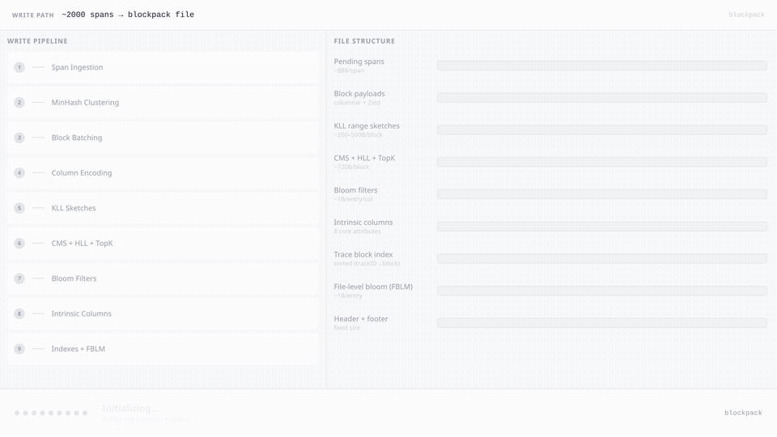

# Write Path

This page describes the complete journey from an incoming OTLP spans batch to a finished `.blockpack` file on disk. The write path is designed for high throughput with minimal memory overhead, deferring expensive work as long as possible and clustering data for maximum compression.

## Animation



---

## Overview

```
AddTracesData / AddSpan / AddLogsData
  → pendingSpan buffer (lightweight records, 88 bytes each)
  → auto-flush at 5× MaxBlockSpans (default 10 000 spans)
    → sort by (service.name, MinHashSig, TraceID)
    → batched into blocks of ≤ 2 000 spans each
    → per block: column encoding, KLL sketch, CMS+HLL+TopK, BinaryFuse8 bloom
  → Flush()
    → apply KLL bucket boundaries to range index
    → write metadata section (snappy-compressed)
    → write file header
    → write compact trace index
    → write intrinsic section
    → write footer V4
```

The only public entry points are `AddTracesData`, `AddSpan`, `AddLogsData`, and `Flush`. Everything else is internal batching and encoding.

## Source

| File | Purpose |
|---|---|
| [`internal/modules/blockio/writer/writer.go`](https://github.com/grafana/blockpack/blob/main/internal/modules/blockio/writer/writer.go) | Main write API (`AddTracesData`, `Flush`) |
| [`internal/modules/blockio/writer/writer_sort.go`](https://github.com/grafana/blockpack/blob/main/internal/modules/blockio/writer/writer_sort.go) | MinHash clustering and sort |
| [`internal/modules/blockio/writer/writer_block.go`](https://github.com/grafana/blockpack/blob/main/internal/modules/blockio/writer/writer_block.go) | Block encoding, column selection |
| [`internal/modules/blockio/writer/kll.go`](https://github.com/grafana/blockpack/blob/main/internal/modules/blockio/writer/kll.go) | KLL sketch construction |
| [`internal/modules/blockio/writer/sketch_index.go`](https://github.com/grafana/blockpack/blob/main/internal/modules/blockio/writer/sketch_index.go) | CMS, HLL, TopK, BinaryFuse8 per block |
| [`internal/modules/blockio/writer/intrinsic_accum.go`](https://github.com/grafana/blockpack/blob/main/internal/modules/blockio/writer/intrinsic_accum.go) | Intrinsic column accumulation |
| [`internal/modules/blockio/writer/metadata.go`](https://github.com/grafana/blockpack/blob/main/internal/modules/blockio/writer/metadata.go) | Metadata serialization and index writing |
| [`internal/modules/blockio/writer/range_index.go`](https://github.com/grafana/blockpack/blob/main/internal/modules/blockio/writer/range_index.go) | Range index / KLL bucket assignment |

---

## Stage 1: Span Ingestion

When `AddTracesData` or `AddSpan` is called, the writer does **not** immediately decode the span into column form. Instead it creates a `pendingSpan` record:

```go
type pendingSpan struct {
    rs         *tracev1.ResourceSpans  // proto pointer (anchored in protoRoots)
    ss         *tracev1.ScopeSpans
    span       *tracev1.Span
    svcName    string                  // sort key: zero-copy ref into proto
    minHashSig [4]uint64               // MinHash of attribute set (4 × uint64)
    traceID    [16]byte                // sort key (tertiary)
    srcBlock   *reader.Block           // non-nil only on the compaction path
    srcRowIdx  int
}
```

**Size: ~88 bytes** — a deliberate choice. The alternative (`BufferedSpan` with 13 pointer fields) was ~344 bytes and caused 3× RSS vs. Parquet for large WAL blocks. By storing only proto pointers and sort keys, the writer keeps 10 000 spans in under 1 MB while deferring all `AttrKV` materialization to flush time.

The proto root is anchored in `w.protoRoots` until `flushBlocks()` processes it. After flushing, `protoRoots` is cleared so the GC can reclaim that batch's memory.

**Auto-flush** triggers when `len(w.pending) >= MaxBufferedSpans` (default: 5 × `MaxBlockSpans` = 10 000). This bounds live memory to roughly one batch of five blocks.

---

## Stage 2: MinHash Clustering

Before block assignment, `flushBlocks()` sorts the pending buffer by:

```
(service.name ASC, MinHashSig ASC, TraceID ASC)
```

**MinHashSig** is computed at ingestion time (in `computeMinHashSigFromProto`) using classic bottom-k MinHash: hash all `key=value` pairs using FNV-1a; keep the four smallest hashes. Spans with similar attribute sets (same region, environment, version, etc.) produce similar MinHash signatures and therefore land adjacent in the sort order.

Why this matters for compression: within a block, adjacent spans are likely to share the same resource attributes (service name, region, env). Dictionary columns for `resource.*` attributes then compress near-perfectly — the dictionary has few entries, and the index array is nearly constant. In real workloads this contributes meaningfully to the 10–50× compression ratio.

The sort is applied to a separate index slice (O(n log n) comparisons without copying `pendingSpan` values), then the final permutation is applied in a single O(n) copy pass.

---

## Stage 3: Block Batching

After sorting, the buffer is sliced into blocks of at most `MaxBlockSpans` spans (default **2 000**). Each block gets a sequentially-assigned block ID (0-based `uint16`). The maximum is 65 534 blocks per file.

`buildAndWriteBlock` constructs each block from its slice of `pendingSpan` records, writes the serialized bytes immediately to the output stream, and returns per-block statistics (min/max per column, sketch data, trace rows).

Blocks are written **immediately** — the writer streams to disk rather than buffering the entire file in memory.

---

## Stage 4: Column Encoding

Full OTLP-to-column decoding happens in `addRowFromProto`, called once per span inside `buildBlock`. Each span's attributes are decoded into typed column builders (`stringColumnBuilder`, `uint64ColumnBuilder`, etc.), which accumulate values until `finalize()` serializes the block.

The writer selects among **11 encoding kinds** at finalize time (kinds 1, 2, 5–13; kinds 3–4 are reader-only legacy formats):

| Kind | Name | Used for |
|------|------|----------|
| 1 | Dictionary | String/numeric columns with low-to-medium cardinality; dict payload zstd-compressed |
| 2 | Sparse Dictionary | Same as Dictionary but with sparse presence (>50% nulls) |
| 5 | Delta Uint64 | Uint64 columns where range ≤ 65 535, or range ≤ uint32 with cardinality > 3 |
| 6 | RLE Indexes | Index arrays when cardinality ≤ 3 (e.g., boolean-like enums) |
| 7 | Sparse RLE Indexes | Sparse variant of RLE Indexes |
| 8 | XOR Bytes | Bytes columns (non-URL, non-trace-ID): XOR against previous row, zstd |
| 9 | Sparse XOR Bytes | Sparse variant of XOR Bytes |
| 10 | Prefix Bytes | URL/path columns (`.url`, `.uri`, `.path`, `.target`): shared-prefix dictionary |
| 11 | Sparse Prefix Bytes | Sparse variant of Prefix Bytes |
| 12 | Delta Dictionary | `trace:id` column: delta encoding within a sorted dictionary |
| 13 | Sparse Delta Dictionary | Sparse variant of Delta Dictionary |

**Selection logic** (`encoding_select.go`):
- Bytes columns → XOR (kind 8/9) or Prefix (kind 10/11) based on `isURLColumn`
- `trace:id` specifically → Delta Dictionary (kind 12/13)
- Other ID columns (`.id`, `_id` suffix, `span:id`, `span:parent_id`) → XOR (kind 8/9)
- Uint64 columns → Delta (kind 5) when `shouldUseDeltaEncoding` returns true; otherwise Dictionary (kind 1/2)
- All other numeric/string columns → Dictionary (kind 1/2) or RLE Indexes (kind 6/7) when cardinality ≤ 3

Presence is encoded using RLE over a bitset (not stored per-value), so sparse columns pay only for their non-null rows.

All column data blobs are individually zstd-compressed (or snappy for metadata), then written contiguously in the block with a column metadata header.

---

## Stage 5: KLL Sketches

During block construction, `buildAndWriteBlock` feeds each block's observed `(column, minValue, maxValue)` pair into a per-column KLL sketch in the `rangeIndex`. At `Flush()` time, `applyRangeBuckets` calls each KLL sketch's `Boundaries(1000)` to produce 1 000 quantile bucket boundaries, then assigns each block to all overlapping buckets.

The resulting range index is used at query time for **interval-match pruning** — for example, `span:duration > 5ms` prunes all blocks whose maximum duration falls below 5ms without reading block data.

See [KLL.md](KLL.md) for algorithm details.

---

## Stage 6: CMS + HLL + TopK

During every call to `updateMinMax` (once per non-null value in each column), the writer also feeds the encoded value key into three sketch accumulators via `blockSketchSet.add`:

- **HyperLogLog** — cardinality estimate per column per block
- **Count-Min Sketch** — frequency estimate per column per block
- **TopK** — top-20 most frequent values per column per block

These are accumulated per block and serialized in the sketch index section at `Flush()`.

See [HLL.md](HLL.md), [CMS.md](CMS.md), and [TopK.md](TopK.md) for algorithm details.

---

## Stage 7: Bloom Filters (BinaryFuse8)

Also during `updateMinMax`, every value key is hashed (via `sketch.HashForFuse`) and appended to a `keys []uint64` slice per column per block. At the end of `writeSketchIndexSection`, a `BinaryFuse8` filter is constructed from those keys and serialized alongside each column's CMS and HLL data.

At query time, the fuse filter answers "does this column in this block contain value X?" with no false negatives (~0.39% false positive rate).

There is also a **file-level bloom filter** (FBLM) over `resource.service.name` across the entire file, allowing a single `Contains` check to skip all block I/O when the queried service is not in the file at all.

See [Bloom-Filter.md](Bloom-Filter.md) for details.

---

## Stage 8: Intrinsic Columns

Alongside each per-block column builder, the writer maintains a file-level `intrinsicAccumulator`. Intrinsic columns are fed into it row-by-row during block building.

**Core columns (always present):**
- `trace:id` — bytes
- `span:name`, `resource.service.name` — strings (dict-encoded file-wide)
- `span:start`, `span:duration` — uint64 flat
- `span:kind` — int64 dict

**Conditional columns (fed only when the value is present):**
- `span:id`, `span:parent_id` — bytes (absent for root spans or spans with no parent)
- `span:status`, `span:status_message` — int64 dict / string (absent when the span has no Status object)

At `Flush()`, these are encoded and written as a contiguous intrinsic section, with a TOC (Table of Contents) blob pointing to each column blob. Intrinsic columns are stored sorted by value with `BlockRef` pointers back to block+row, enabling tag discovery (`SearchTags`, `SearchTagValues`) and certain query patterns without reading any block data.

See [Intrinsic-Columns.md](Intrinsic-Columns.md) for details.

---

## Stage 9: Indexes + FBLM

After all blocks are written, `Flush()` writes the following file-level structures in order:

| Structure | Description |
|-----------|-------------|
| **Metadata section** | snappy-compressed; contains block index, range index, trace→block index, TS index, sketch index |
| **File header** | Version, signal type, metadata offset + length |
| **Compact trace index** | Binary-sorted (TraceID → []uint16 block IDs) for single-trace fetch |
| **Intrinsic section** | File-level columnar data for core and conditional intrinsic attributes + TOC |
| **Footer V4** | Offsets to header, compact index, and intrinsic section |

The **TS index** records per-block (minStart, maxStart) pairs sorted for direction-aware traversal (newest-first or oldest-first queries). The **range index** contains, per column, a map from KLL bucket key to sorted block IDs. The **trace index** maps each TraceID to all block IDs that contain spans from that trace.

---

## Size Breakdown (Approximate, Per 2 000-Span Block)

These numbers vary widely with data characteristics (cardinality, attribute count, value sizes).

| Structure | Typical size | Notes |
|-----------|-------------|-------|
| Block header | 24 bytes | Fixed |
| Column metadata array | 200–600 bytes | Scales with column count |
| `trace:id` column | 5–10 KB | Delta-dict encoded, high entropy |
| `span:id` column | 2–5 KB | XOR encoded |
| `span:start` column | 1–3 KB | Delta encoded (timestamps are monotone) |
| `span:duration` column | 1–4 KB | Delta or dict |
| `span:name` column | 1–5 KB | Dict, usually low cardinality |
| Dynamic attribute columns | 2–20 KB | Highly variable |
| KLL sketch data | 200–500 bytes per range column | Serialized in range index |
| HLL per column | 16 bytes | Fixed-size per column per block |
| CMS per column | 512 bytes | Fixed-size per column per block |
| TopK per column | ~200 bytes typical | 20 entries × ~10 bytes each |
| BinaryFuse8 per column | ~N bytes (N = distinct values) | ~1 byte per distinct value |
| **Total typical block** | **20–80 KB compressed** | Uncompressed ~100–400 KB |
